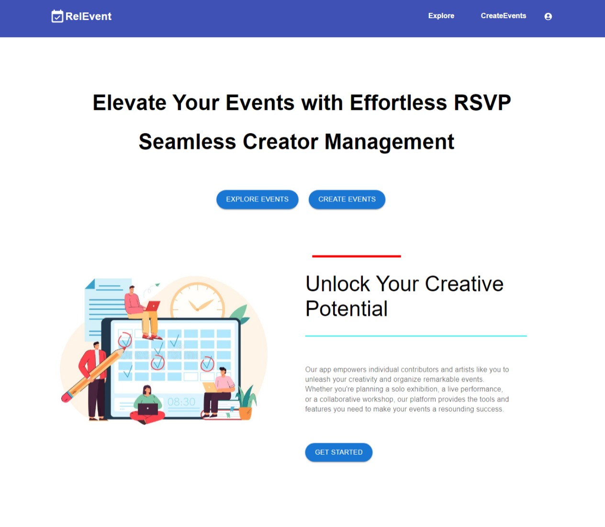
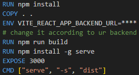
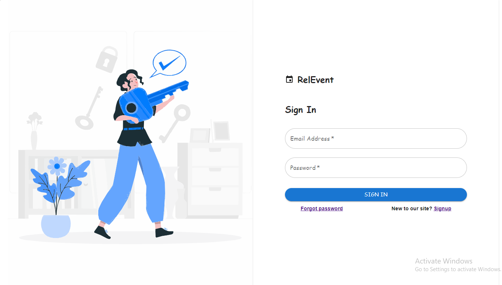
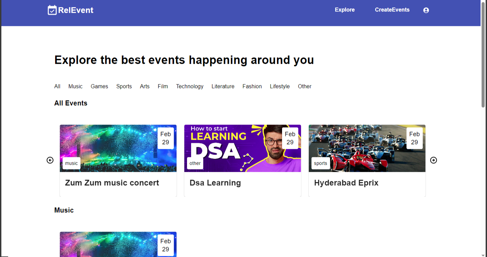
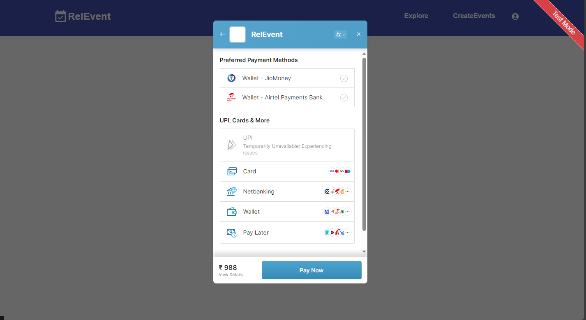
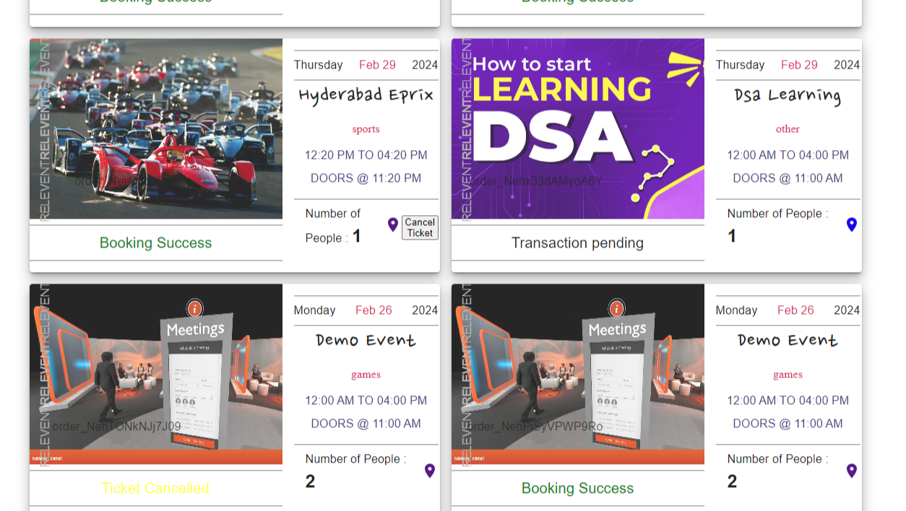

# REL-EVENT (Frontend)
### About Project


Struggling with event management complexities? Existing systems often leave users frustrated with convoluted interfaces and cumbersome processes. Our Event Management System __REL-EVENT__ revolutionizes event organization, attendee registration, and volunteer coordination, offering an intuitive platform that simplifies the entire process. With streamlined event creation, seamless attendee registration, and efficient volunteer management, Rel-Event bridges the gap between organizers, attendees, and volunteers, ensuring a smooth and hassle-free experience for all. It even let's all the users to perform all the roles. Join us in redefining event management

(The following code is only for the frontend. For backend use [RelEvent Backend](https://github.com/Anirudh-B-Mitta/rel_event.git))

## Running the App
<p>Usage of this application can be done in three ways.</p>
<p>The first would be running it in the localhost of your system where you and only you can access the application.</p>
<p>The second way is to host it on any cloud service like AWS with the help of containerzation tool such as Docker.</p>
<p>The next type is to use Jenkins for CI/CD.</p>

## Localhost
<p>To run the application in the localhost it is required to have Node JS 20.0 or above in the system</p>

### Step 1
<p>Download the project code into your system and unzip it.</p>
<p>OR</p>
<p>Clone the repo from the github by using the following command:</p>

```bash
git clone https://github.com/siddarthal/AlphaProject.git
```

### Step 2
Navigate into `AlphaProject/Part1` and install the required dependencies. The dependencies are present in `package.json` file. They can be installed through the following command:
```sh
npm i #npm install (can also be used)
```

### Step 3
In the terminal use the given command to start the development server.
```sh
npm run dev
```

This command runs in the port `5173`

Go to browser and type __127.0.0.1:5173__ to see your application.

__Hurray!! It's running__

#### NOTE: Please run the backend server before starting the frontend ([RelEvent Backend](https://github.com/Anirudh-B-Mitta/rel_event.git))

## Docker Container
The second type of running the application is through Docker. The below steps are given assuming `Docker` is installed.

### Step 1
<p>Download the project code into your system and unzip it.</p>
<p>OR</p>
<p>Clone the repo from the github by using the following command:</p>

```bash
git clone https://github.com/siddarthal/AlphaProject.git
```

### Step 2
There is a Dockerfile in the project's root directory. Give your backend url in place of `****`.

 

 Build a Docker Image using the given file, using the below command:
```sh
docker build -t frontend .
```
### Step 3
Run the image in a container to access your application through the following command:
```sh
docker run --name frontend -d -p 3000:3000 frontend
```

Go to browser and type __\<your IP>:3000__ to see your application

__TaDa!! It's working__

#### NOTE: Please run the backend server before starting the frontend ([RelEvent Backend](https://github.com/Anirudh-B-Mitta/rel_event.git))

## Jenkins
The next type for hosting the application is through Jenkins. Here you can connect it to your git and trigger the build for every change you make.

The below steps are given assuming Jenkins and Docker are installed.

### Step 1
Clone the github repository and add it to your github

### Step 2
Create a Free-style project in Jenkins and configure it with following details:
- Give your description
- Select Github Project and give your project url
- In source code management select git, give your repository url followed by credentials related to it. Specify the branch to be built.
- Go to build triggers and check `Github Hook triggers`
- In the Build steps select `Execute shell` and type the following:
```sh
docker stop frontend || true
docker rm frontend || true
docker rmi frontend || true
cd part1
docker build -t frontend .
docker run --name frontend -d -p 3000:3000 frontend
```
- Apply and Save the configuration
- Build manually for the first time, from next time whenever a git push is done it gets triggered automatically.

__Now your applicatiion is ready__

The outputs may look like:

### Signin


### Explore


### Payment


### Tickets
